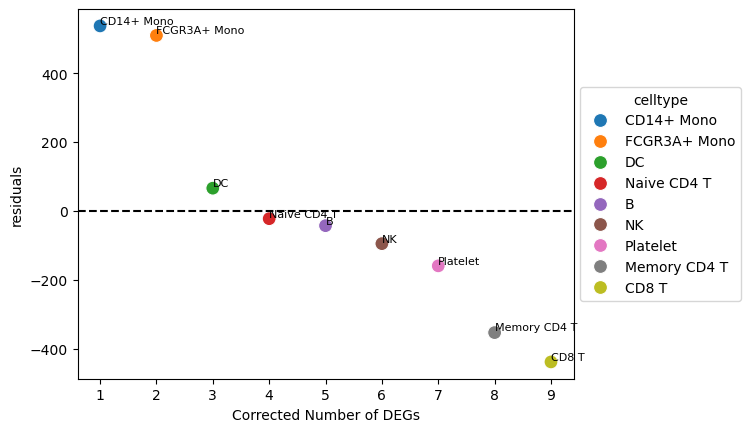

There is a logical leap in identifying cell types with large transcriptome changes across conditions based on the number of differentially expressed genes.
To overcome this, we propose a function that obtains a linear model between the number of cells and the number of DEGs for each cell type and utilizes the residuals to identify cell types with large transcriptome changes.

```R
library(Seurat)
library(ggplot2)
library(dplyr)

### Input; dataframe including celltype, num_deg, num_cell -----
meta = seurat@meta.data
celltype_list = levels(meta$celltype) # cell type vector
DEG_df = data.frame(celltype = celltype_list,
                    num_deg = rep(0, length(celltype_list)),
                    num_cell = rep(0, length(celltype_list)))

for(i in 1:length(celltype_list)) {
  DEG = get(paste0('DEG_', celltype_list[i])) # Get your DEGs
  DEG_sig = DEG[DEG$p_val_adj < 0.05 & abs(DEG$avg_log2FC) > 0.5,] # DEG threshold (user-defined)
  DEG_df$num_deg[i] <- nrow(DEG_sig) # Number of DEGs for each cell type
  DEG_df$num_cell[i] <- nrow(meta[meta$celltype == celltype_list[i],]) # Number of cells for each cell type
}

### Function -----
# "celltype_color" is a vector containing color information for each cell type used in the annotation visualization.

corrected_deg <- function(DEG_df, celltype_color) {
  # modeling linear regression
  model <- lm(num_deg ~ num_cell, data = DEG_df)
  
  # calculating residuals for each cell type
  DEG_df$residuals <- residuals(model)
  
  # ranking cell type
  DEG_df_rank <- DEG_df %>%
    arrange(desc(residuals)) %>%
    mutate(rank = row_number())
  
  # plotting rankplot
  ggplot(DEG_df_rank, aes(x = rank, y = residuals, color = celltype)) +
    geom_point(size = 3) +
    geom_line(aes(group = celltype)) +
    geom_text(aes(label = celltype), vjust = -1, hjust = 0.2, size = 3, color = "black") +
    scale_color_manual(values = celltype_color) +
    geom_hline(yintercept = 0, linetype = "dashed", color = "black") +
    labs(x = "Rank",
         y = "Corrected Number of DEGs") +
    theme_classic()
}

corrected_deg(DEG_df, celltype_color)
```


And the following is the python transcript.

```py
def corrected_deg(
    deg_df: pd.DataFrame, celltype_color: list[str] | sns.palettes._ColorPalette
) -> plt.Figure:
    # modeling linear regression
    X = deg_df[["num_cell"]].values.reshape(-1, 1)
    y = deg_df["num_deg"].values
    model = sklearn.linear_model.LinearRegression().fit(X, y)

    # calculating residuals for each cell type
    deg_df["residuals"] = y - model.predict(X)

    # ranking cell type
    deg_df = deg_df.sort_values(by="residuals", ascending=False).reset_index(drop=True)
    deg_df["rank"] = deg_df.index + 1

    # plotting rankplot
    fig = plt.figure()

    sc = sns.scatterplot(
        data=deg_df,
        x="rank",
        y="residuals",
        hue=range(len(deg_df)),
        palette=celltype_color,
        s=100,
    )

    for _, row in deg_df.iterrows():
        plt.text(
            row["rank"],
            row["residuals"],
            row["celltype"],
            verticalalignment="bottom",
            horizontalalignment="left",
            fontsize=8,
            color="black",
        )

    # Add horizontal line at y=0
    plt.axhline(y=0, linestyle="--", color="black")
    plt.xlabel("Rank")
    plt.ylabel("Corrected Number of DEGs")
    plt.legend(
        sc.get_legend_handles_labels()[0],
        {i: i for i in deg_df["celltype"]},
        loc="center left",
        bbox_to_anchor=(1, 0.5),
        title="celltype",
    )

    plt.grid(False)

    return fig
```


